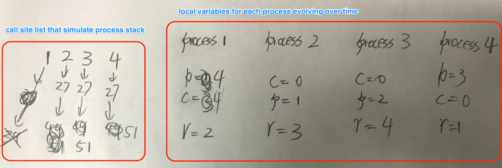

# Process

## Memory Structure
* **Text**: code -- program instructions
* **Data**:
    * global variables
    * heap --- dynamic allocations
* **Stack**:
    * activation records (function calls), automatic growth/shrinkage
        * one per pending procedure
        * where to return to
        * link to the previous record
        * auto variables (local variables)
        * other, including register values

**Stack Pointer (SP)**: point to the top of process stack.

**The magic of `yield(p)`**
```C
yield (p){
    int magic;
    magic = 0;
    saveContext(me);
    if magic == 1   return;
    else magic = 1;
    restoreContext(p)
}
```
* if magic = 1: The control flow has already yielded to `p` and back to our current process `me`
* if magic = 0: The control flow is about to yield to another process `p`
* If we do not use the variable `magic`, the control flow will stuck in the `restoreContext(p)` instruction.


## Homework Notes


#### `Fork()`
* Create a child process, with a memory that is almost identical to that of the parent.
* Child starts its executing by the returning from `Fork()`.
* Choosing which procedure to execute next depends on the scheduling algorithm
* Return value:
    * For the parent process: return value is the **pid** of the child process.
    * For the child process: return value is 0.

|  | get child pid | get parent pid |
| -- | -- | -- |
| from child | `Getpid()` | save the value of `Getpid()` to a variable in advance (before `fork`) |
| from parent | return value of `fork` | `Getpid()` |

---
#### `Yield(p)`
* Switch the control flow to the process whose pid is `p`
* The return value is the pid of the process that latestly exited or terminated or yielded (where the control flow come from)

---

For a complex program simulate problem, it is a nice idea to maintain a call site list, each element represent a process, and for each process, maintain the line number where the control flow jumped.


e.g. 